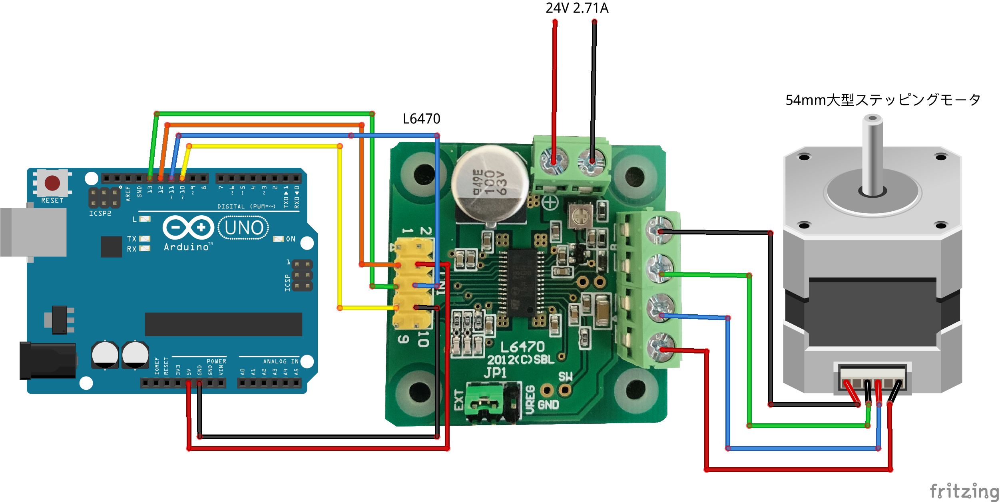
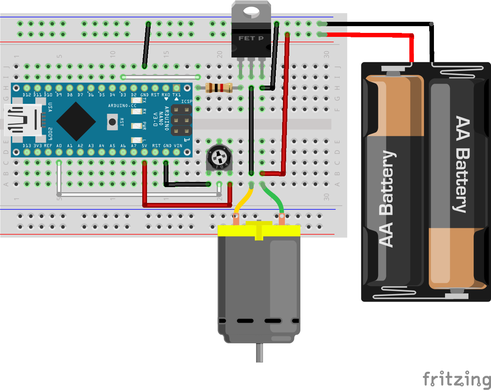

# Polarizer 3D Zoetrope

Strobe system with polarizer and 3D zoetrope

### Hardware Requirements
- [Electronic Parts](https://docs.google.com/spreadsheets/d/1UG0ItNh__mqvVkz9jERgO26RK3c-dwIJX8XIyFTlOHs/edit?usp=sharing)

### Software Requirements
- [L6470Stepper](https://github.com/hideakitai/L6470Stepper)
- [SPIDaisyChain](https://github.com/hideakitai/SPIDaisyChain)

### Wiring

